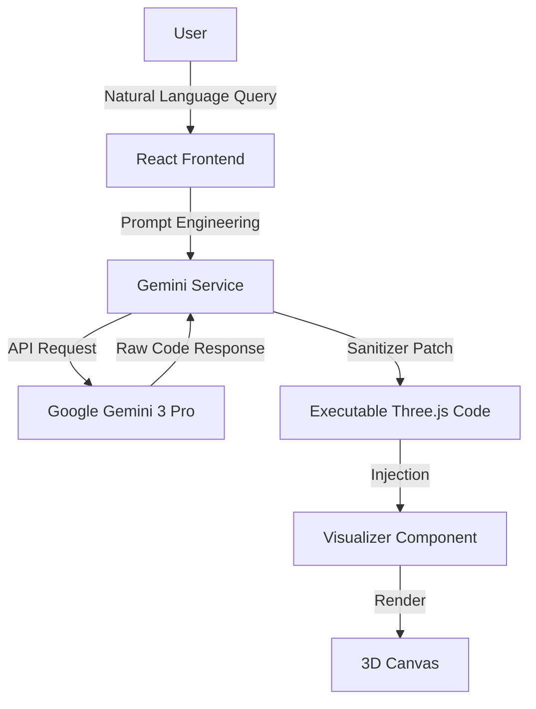
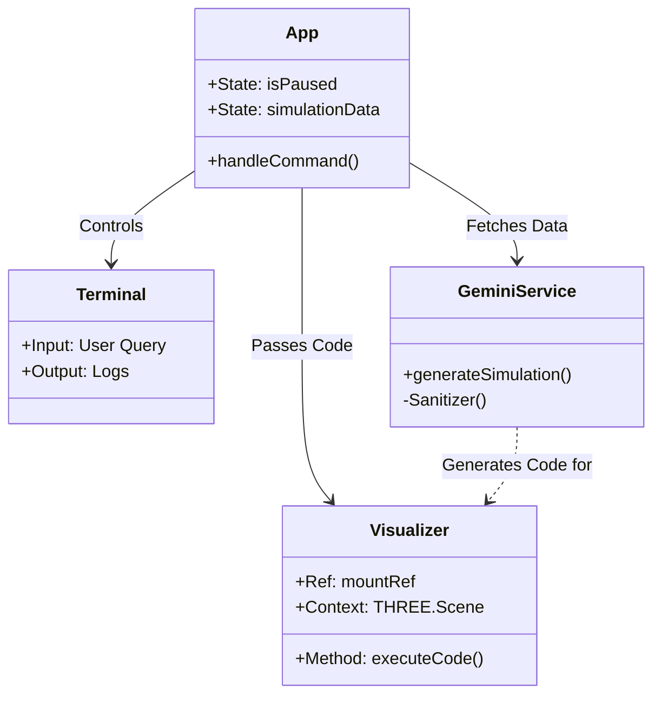
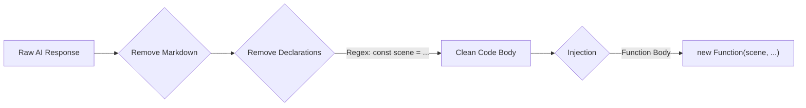
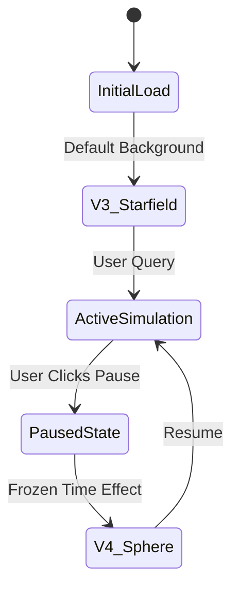

# System Architecture

<a href="./index.md">⬅️ Back to Index</a> | <a href="./journey.md">⬅️ Previous: Journey</a> | <a href="./conclusion.md">Next: Conclusion ➡️</a>

## 🏗️ High-Level Architecture (HLD)

The AXIOM platform acts as a bridge between natural language physics queries and visual 3D simulations.

## ⚙️ Low-Level Design (LLD) & Systems

### The "Brain Transplant" Architecture
Separating the UI state from the Physics engine to prevent crashes and allow for complex interactions.

### The Sanitizer Logic
The critical defense layer that allows the AI to "collaborate" without breaking the host environment.

### UX State Machine
Defining the "Reality OS" feel.

---
<a href="#top">⬆️ Back to Top</a>
